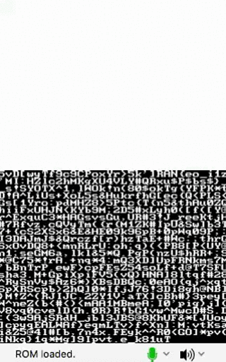

# Matrix

This project fakes that iconic matrix text effect. Really more of a gag but I needed something else to work on since the RTS project is giving me issues. This is more of a trash output but least it comes with a char generator. Can't even easily color the text as well...

### Things to know
* That this really just for fun as this really doesn't teach much
* For some reason "\x1b[1;1m" doesn't clear the printed text, use "\x1b[1;1H" to do that <-- if anything this is why you should care about this code example
* This might be of interest, "demo of ansi escape sequences" source: http://libnds.devkitpro.org/Graphics_2Printing_2ansi_console_2source_2main_8c-example.html

### Understanding the Code

The `gen_random()` function sets a random character to an address and then is printed to the screen

### Preview

[]
