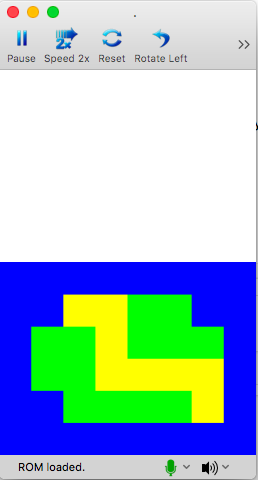

# Tile Generator (bottom screen)

We take what we've learned from multi-simple and instead of randomly placing sprites down, we follow an array. Just like you would in a tile based game. This generates a simple 6 x 8 tiled map of 16x16 sized sprites. 
We used the VRAM Bank D which is specific to the bottom screen and Sprites.

### Understanding the Code

The cool thing about sprite sheets is you can dynamically create maps easily through multi-dimensional arrays. 

In this code we have an array titled `title_array` which contains 6 rows of 8 tiles laid out. As seen below:
````
	int tile_array[6][8] = { // create a map layout
		{0, 0, 0, 0, 0, 0, 0, 0},
		{0, 0, 2, 2, 1, 1, 0, 0},
		{0, 1, 1, 2, 1, 1, 1, 0},
		{0, 1, 1, 2, 2, 2, 2, 0},
		{0, 0, 1, 1, 1, 1, 2, 0},
		{0, 0, 0, 0, 0, 0, 0, 0},
	};
 ````
 
 If you notice there are 3 numbers (0, 1 and 2). These correlate to a specific color to show. As seen below:

````
	int tile_colors[] = {
		ARGB16(1, 0, 0, 31), // blue (water?)
		ARGB16(1, 0, 31, 0), // green (grass?)
		ARGB16(1, 31, 31, 0) // yellow (sand?)
	};
````

#### How does it display on the bottom screen?

With `oamInit(&oamSub, SpriteMapping_Bmp_1D_128, false);`
If you notice `&oamSub` is used as the first passed parameter. This is actually what determines which screen we initalize.

Then if we look at `oamSet()` which is used to allocate the tile in memory the second first parameter is again `&oamSub`.
this tells the DS to draw the object on the bottom screen.

### Preview


