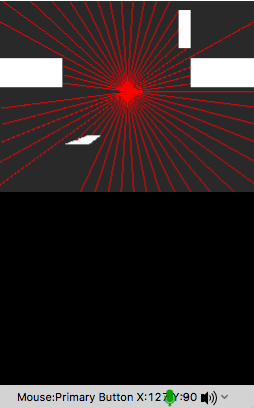

# Ray Casting Example 2
In this example we take multiple rays calculate the intersection of various objects on screen. Based on this source [source](https://github.com/ncase/sight-and-light/blob/gh-pages/draft2.html).

### Understanding the Code
In the first example we took a single ray of detection. In this example we use 50 rays using 360 degrees of seperation.

The big difference this time is `getIntersection` is called for each ray and segment.

# Preview
[] - coming soon

This entire example relies on the NDS version of OpenGL, [more about that in VideoGL.h](http://libnds.devkitpro.org/videoGL_8h.html).
