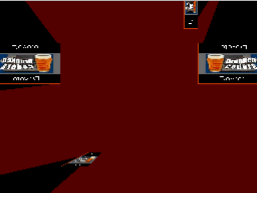

# Ray Casting Example 3.5
Everything in this example is the same as Example_3 except I break the format we've been following. This example does not match anything the ncase example has because it doesn't apply an image to the intersection segments. If you're developing a game, most likely you are going to apply a texture of some sort to a QUAD. In this example we do exactly that because why not. I didn't want to mess with Example 4 at the moment and wanted to figure something new out with OpenGL on the NDS.

# Preview

# Makefile
We'll be using pcx files to load as textures in OpenGL. For the NDS to understand this file it needs it's own header file. To create that we need to make a simple change to our Makefile. Add the following command to the end of the make file before the `endif`
````
#---------------------------------------------------------------------------------
%.pcx.o	:	%.pcx
#---------------------------------------------------------------------------------
	@echo $(notdir $<)
	@$(bin2o)


-include $(DEPENDS)
````

# Code Explained

### data/box.pcx
OpenGL on the NDS works well with pcx files. PCX is a type of image file with certain important meta data. Most editors these days don't have an export to pcx, so you'll need to convert your normal image (I had a png) to pcx with a third party tool. Fortunately, I found a website that does this for you, only issue is they email you the converted file back. So if you are comfortable using your email with this site feel free to use it (I haven't gotten any spam from them yet, so I think it's safe). Here's the website: http://zamzar.com

Also if you notice above we've got to make a change to the `Makefile` so the NDS can understand this pcx file. If you add the correct changes to the `Makefile` you should notice that in the build folder there's a `box_pcx.h` that looks similar to this:
````
extern const u8 box_pcx_end[];
extern const u8 box_pcx[];
extern const u32 box_pcx_size;
````
We'll be using the above `const` as a way to refernce different parts of the image in our source code. So It's important to have this header file.

### Note
This entire example relies on the NDS version of OpenGL, [more about that in VideoGL.h](http://libnds.devkitpro.org/videoGL_8h.html).
