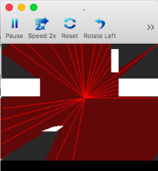

# Ray Casting Example 3
In this example we take multiple rays calculate the intersection of various objects on screen. The only difference between this example and Example 2 is that we are filling the rays for the first time.

If you notice, the filling color actually clips the objects on screen. We'll fix that in example 4.

Based on this source [source](https://github.com/ncase/sight-and-light/blob/gh-pages/draft3.html).

# Preview

# Code Explained
### NDS OpenGL
This entire example relies on the NDS version of OpenGL, [more about that in VideoGL.h](http://libnds.devkitpro.org/videoGL_8h.html).
