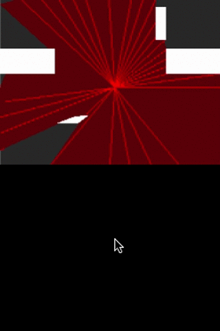

# Ray Casting Example 4
In example_3 we noticed that the filled color clips the segment walls. This example fixes that.

Based on this source [source](https://github.com/ncase/sight-and-light/blob/gh-pages/draft4.html).

# Understanding the code
In example_3 the reason the filling color clips the walls is because we are randomly placing the filled rays.
One way to fix that is to actually interpolate the rays and the segment wall. Then create a new ray at the corners of the segment wall. This then allows us to have a truely accurate ray casting as seen in the preview gif below.

# Preview

Sorry for the slow gif, the mov to gif creator slows it down for some reason. 
This demo actually works as if in real time on simulator and device

# Controls
Move the `stylus` on the bottom screen to move he ray casting center around the top screen.
