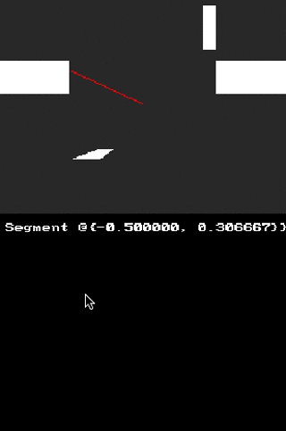

# Ray Casting Example 1
In this example we take a single ray from the origin of the screen and calculate the intersection of various objects on screen.

# Preview
[]

# Code Explained
### Intro to NDS OpenGL
So this is the first introduction to OpenGL on the NDS. Fortunately, I have a decent amount of experience but it's not that extreme of a topic. Actually, I think it might be easier then what we've learned with OAM and Sprites. In any case this entire example relies on the NDS version of OpenGL, [more about that in VideoGL.h](http://libnds.devkitpro.org/videoGL_8h.html).

### Understanding *Coord getIntersection(Ray ray, Ray segment);*
The `Coord getIntersection(Ray ray, Ray segment);` function is literally where the main computation of Ray Casting occures in this example. It's a monster but let's break it down into very simple understandings. I actually didn't understand this at all coming into it so through trail and a basic understanding of Ray Casting I was able to come to the conclusion below.

Again this was ported from an HTML5 example, [source](https://github.com/ncase/sight-and-light/blob/gh-pages/draft1.html).